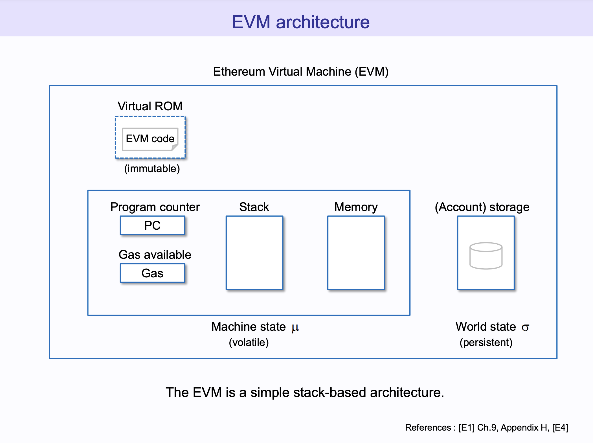

## The Ethereum Virtual Machine (EVM)

Starting from the [Ethereum foundation definition](https://ethereum.org/developers/docs/evm#from-ledger-to-state-machine):

> Ethereum's state is a large data structure which holds not only all accounts and balances, but a machine state, which can change from block to block according to a pre-defined set of rules, and which can execute arbitrary machine code. The specific rules of changing state from block to block are defined by the EVM.

From the above we get that the Ethereum blockchain is a distributed state machine and that the [Ethereum Virtual Machine](https://ethereum.org/developers/docs/evm) is a software-based emulation of a physical computer (virtual machine) used to operate (compute state transitions) it in a deterministic way.

Execution Environment: The EVM is where smart contracts are executed. Each Ethereum node runs an EVM instance, allowing it to participate in executing and validating smart contracts and transactions.

Deterministic: The EVM is deterministic, meaning that a smart contract will produce the same output given the same input, regardless of which node in the network executes it. This is essential for maintaining consensus across the network.

TL;DR - the EVM is the common computer used to run logic on the Ethereum network and hold all user state (balances, contract code, etc.).

---

Diagram - The EVM Illustrated by Takenobu:

Source: The EVM illustrated, https://takenobu-hs.github.io/downloads/ethereum_evm_illustrated.pdf

---

## The concept of zk-Rollup

The zk in zk-Rollup and zkEVM means _zero-knowledge_. It refers to the cryptographic method by which one party (the prover) can prove to another party (the verifier) that a statement is true. In the case of an Kakarot zkEVM, the prover (the rollup) proves to the verifier (Ethereum L1) that a batch of L2 transactions are valid.

The integrity of these so-called batches is mathematically guaranteed by zero-knowledge proofs (also called validity proofs when they are not privacy preserving).

To dive deeper, you can refer to a [high-level article about zero-knowledge proofs](https://medium.com/starkware/stark-math-the-journey-begins-51bd2b063c71), written by the inventors of STARK proofs: Starkware.

To grasp the value of zk-Rollups, it is important to understand that when a transaction is executed on Ethereum, all the full nodes in the network run it locally to verify its integrity. Therefore, each transaction is executed hundreds of thousands of times in order to agree on the network's truth. The idea behind zk-Rollups is to run a transaction once, compute that transaction's proof of integrity and thereafter only verify this proof without re-running the initial transaction. Luckily for us (and the Rollup centric roadmap of Ethereum), the verification of a transaction's proof is (asymptotically) exponentially cheaper than re-running that same transaction.

From there is derived the protocols of zk-Rollups. As per the [Ethereum website](https://ethereum.org/developers/docs/scaling/zk-rollups#what-are-zk-rollups):

> Zero-knowledge rollups (ZK-rollups) bundle (or 'roll up') transactions into batches that are executed off-chain. Off-chain computation reduces the amount of data that has to be posted to the blockchain. ZK-rollup operators submit a summary of the changes required to represent all the transactions in a batch rather than sending each transaction individually. They also produce validity proofs to prove the correctness of their changes.

TL;DR - execute off-chain, verify on-chain, save on costs.

## What does it mean to prove the EVM: the transition from EVM to zkEVM?

A zkEVM is simply a zk-Rollup that is compatible with Ethereum. This means that users should be able to interact with it as if they were interacting with Ethereum (or almost). For instance, users will use the same tools on a zkEVM than on Ethereum L1, such as the same wallet (e.g. Metamask). Developers' smart contracts should be deployable to a zkEVM without any (or little) changes.

A zkEVM also designates the software used to prove Ethereum-compatible transactions and blocks. It refers to code that is used to go from an EVM transaction to a zero-knowledge (or validity) proof. The implementation of a zkEVM can be either low-level (at the so-called "circuits" level) or high-level (use an intermediary zkVM). [Scroll](https://scroll.io/) is an embodiment of the former, and Kakarot of the latter.

TL;DR: Execute Ethereum-compatible transactions on a Layer 2, prove them off-chain, bundle and verify them on Ethereum L1. Save on costs, benefit from an existing ecosystem: the Ethereum community.
